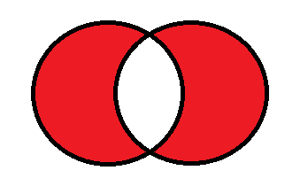

# Coremoran - Blue Prism - Joins
- [License](LICENSE)

This library performs SQL like joins between [BluePrism](https://www.blueprism.com/) collections.

## API

### Key selectors

Key parameters are simple ```Text``` comma separated value expressions.
Regard the following rules
- The key field order is important
- The key name is NOT important
- All special characters for column names are allowed (except ',')
- All column names will be trimmed

#### Examples
    "KeyColum"
    "KeyColum1, KeyCol2"

### Result selectors

Result selector are ```Text``` comma separated value expressions.
Important are the following rules
- Take self care about name collisions
- Rename columns with an ```as``` expression (see examples)
- Use an asterisk (```*```) to refer all columns

#### Examples
    "*"
    "Col1, Col2"
    "Col1, Col2 as Birtdate"

### Inner Join


This action combines all matches of the left collection  with all matching records of the right collection  using the given keys.
The result will contain the defined columns.

|Parameter|Type|Required|Description|
|---------|----|--------|-----------|
|Left|Collection|yes|The left collection|
|Right|Collection|yes|The right collection|
|LeftKeySelector|Text|yes|All key columns of the left collection as CSV|
|RightKeySelector|Text|yes|All key columns of the right collection as CSV|
|LeftResultSelector|Text|no/yes*|All result columns of the left collection as CSV|
|RightResultSelector|Text|no/yes*|All result columns of the right collection as CSV|

\* Either ```LeftResultSelector``` or ```RightResultSelector``` are required

### Left Join


This action will returm all records in the left collection . If there are matching records in the right collection  according to the given keys, the records will join to the matching records of left collection .
The result will contain the defined columns.

|Parameter|Type|Required|Description|
|---------|----|--------|-----------|
|Left|Collection|yes|The left collection|
|Right|Collection|yes|The right collection|
|LeftKeySelector|Text|yes|All key columns of the left collection as CSV|
|RightKeySelector|Text|yes|All key columns of the right collection as CSV|
|LeftResultSelector|Text|yes|All result columns of the left collection as CSV|
|RightResultSelector|Text|yes|All result columns of the right collection as CSV|

### Left Excluding Join


This query will return all of the records in the left collection that do not match any records in the right collection.
The result will contain the defined columns.

|Parameter|Type|Required|Description|
|---------|----|--------|-----------|
|Left|Collection|yes|The left collection|
|Right|Collection|yes|The right collection|
|LeftKeySelector|Text|yes|All key columns of the left collection as CSV|
|RightKeySelector|Text|yes|All key columns of the right collection as CSV|
|LeftResultSelector|Text|yes|All result columns of the left collection as CSV|

### Full (outer) Excluding Join



This query will return all of the records in the left collection and all of the records in the right collection that do not match.
The result will contain the defined columns.

|Parameter|Type|Required|Description|
|---------|----|--------|-----------|
|Left|Collection|yes|The left collection|
|Right|Collection|yes|The right collection|
|LeftKeySelector|Text|yes|All key columns of the left collection as CSV|
|RightKeySelector|Text|yes|All key columns of the right collection as CSV|
|LeftResultSelector|Text|yes|All result columns of the left collection as CSV|
|RightResultSelector|Text|yes|All result columns of the right collection as CSV|

### Full (outer) Join


This query will return all of the records from both collections, joining records from the left collection that match records from the right collection.
The result will contain the defined columns.

|Parameter|Type|Required|Description|
|---------|----|--------|-----------|
|Left|Collection|yes|The left collection|
|Right|Collection|yes|The right collection|
|LeftKeySelector|Text|yes|All key columns of the left collection as CSV|
|RightKeySelector|Text|yes|All key columns of the right collection as CSV|
|LeftResultSelector|Text|yes|All result columns of the left collection as CSV|
|RightResultSelector|Text|yes|All result columns of the right collection as CSV|

## Installation

Simply install the ```.bprelease``` file. This installs the VBO and three environment variables.

There is another ```.bprelease``` file which contains BluePrism unit tests for the VBO. This package needs the [Coremoran - Utility - JSON](https://github.com/toarnold/Coremoran.BluePrism.Json) VBO.

### Configuration

In BluePrism go to System -> Objects -> Environment Variables


The ```Nuget: ...``` variable is a csv (comma separated value) and has the following scheme ```<NuGet-Package-Name,Package-Version,Relativ-Assembly-Path-inside-the-package>```.
If multiple VBOs are using this package all should reference and use this environment variable to avoid assembly-version-hell.

Configure ```BluePrismAddOnDirectory``` to an existing directory. This directory will hold your expanded NuGet packages and other assemblies if needed.

Download the latest [nuget.exe](https://www.nuget.org/downloads) version and place it in this directory

Inside this directory create a folder named ```Packages```. If you are behind a corporate proxy and Nuget isn't reachable download the needed packages and place them inside the ```Packages``` folder.

The result should look like


